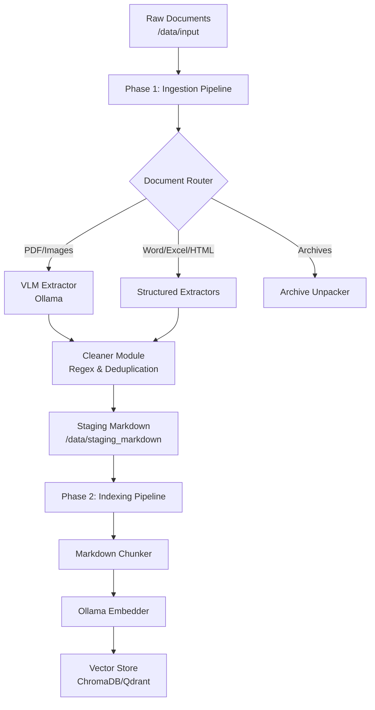

# RAG Document Ingester

An enterprise-grade, configuration-driven document processing pipeline designed to prepare heterogeneous files for Retrieval-Augmented Generation (RAG). 

Built heavily upon **SOLID** principles, this framework avoids hardcoding and relies entirely on dynamic registries and a central `config.yaml` to orchestrate file extraction, cleaning, chunking, and embedding.

---

## 🏗️ Architecture Overview

The system is cleanly divided into two major phases:

### Phase 1: Extraction & Cleaning
Converts highly diverse file formats (PDFs, Word docs, Spreadsheets, HTML, presentations, and images) into standardized, clean Markdown. It utilizes Vision Language Models (VLMs) via Ollama for complex PDFs and images, alongside robust python libraries (`pandas`, `python-docx`, `beautifulsoup4`) for text-heavy documents.

### Phase 2: Indexing
Reads the cleaned Markdown, chunks it semantically based on Markdown headers, generates embeddings, and upserts the data into a Vector Database.



---

## 📂 Project Structure

```text
├── main.py                     # CLI Entry point
├── config.yaml                 # Master configuration (extractors, cleaners, indexing)
├── TODO.md                     # Backlog and future roadmap
├── data/
│   ├── input/                  # Place raw files here
│   ├── output/                 # Destination for raw extractions
│   └── staging_markdown/       # Cleaned, standardized markdown ready for indexing
└── src/
    ├── core/
    │   └── interfaces.py       # Base classes (BaseExtractor, BaseChunker, Document, Chunk)
    ├── extractors/
    │   ├── registry.py         # Dynamic routing for extractors
    │   ├── pdf.py              # PyMuPDF & VLM vision models
    │   ├── docx.py             # python-docx parser
    │   ├── spreadsheet.py      # pandas DataFrame -> Markdown Table parser
    │   ├── html.py             # BeautifulSoup readability parser
    │   └── universal.py        # MarkItDown fallback
    ├── indexing/
    │   ├── pipeline.py         # Orchestrator for Phase 2
    │   ├── registry.py         # Dynamic routing for indexers
    │   ├── chunkers.py         # Semantic Markdown Splitters
    │   ├── embedders.py        # Local Ollama Embeddings
    │   └── vectorstores.py     # ChromaDB & Qdrant integration
    └── utils/
        └── cleaner.py          # Post-extraction artifact removal & deduplication
```

---

## 🚀 Getting Started

### Prerequisites
1. **WSL2** (Ubuntu recommended)
2. **Python 3.12+**
3. **Ollama** installed locally (running on the host machine or within WSL). Ensure models like `minicpm-v` (for extraction) and `nomic-embed-text` (for embedding) are pulled.

### Installation
```bash
# Create a virtual environment
python -m venv .venv
source .venv/bin/activate

# Install dependencies
pip install -r requirements.txt
```

---

## ⚙️ Usage

The CLI (`main.py`) acts as the entry point for both phases of the pipeline.

### 1. Run the Extraction Pipeline (Phase 1)
To convert files in `data/input/` into cleaned markdown files in `data/staging_markdown/`:
```bash
python main.py --action extract
```
*Note: You can control the behavior of this phase via the `pipeline.mode` setting in `config.yaml` (e.g., `extract_and_clean`, `extract_only`, `clean_only`).*

**To run a single file:**
```bash
python main.py --action extract --file "my_document.pdf"
```

### 2. Run the Indexing Pipeline (Phase 2)
Once your files are cleaned and sitting in `data/staging_markdown/`, chunk and embed them into your Vector Database:
```bash
python main.py --action index
```

---

## 🛠️ Configuration (`config.yaml`)

This framework avoids hardcoding entirely. Everything is configurable via `config.yaml`.

### Extractor Routing
You can define exact behavior based on file extensions. For example:
```yaml
file_rules:
  .docx:
    extractor: "DocxExtractor"
    fallback: "UniversalExtractor"
    params:
      strip_comments: true
    cleanup_rules:
      collapse_newlines: true
```

### Cleaner Module
VLM models frequently hallucinate metadata (e.g., "The image shows..."). You can apply dynamic regex sweeps to strip these out across all extracted documents:
```yaml
cleaner_settings:
  regex_removals:
    - '(?im)^.*The image shows.*$'
```

### Indexing Setup
You can easily hot-swap your Vector Database or Embedding model by changing the string pointers:
```yaml
indexing:
  chunker:
    type: "MarkdownChunker"
  embedder:
    type: "OllamaEmbedder"
    params:
      model: "nomic-embed-text"
  vectorstore:
    type: "ChromaDBStore" # Easily swap to QdrantStore
    params:
      persist_directory: "data/chromadb"
```

---

## 🧠 Extending the Framework

To adhere to SOLID principles, you should **never** modify the `IngestionPipeline` or `IndexingPipeline` directly to add new formats. 

Instead:
1. Create a new class inheriting from the appropriate interface in `src/core/interfaces.py`.
2. Register it in the respective `registry.py` (e.g., `EXTRACTOR_REGISTRY`).
3. Point to it in `config.yaml`.

The pipelines will automatically instantiate your new class using the provided `params`.
