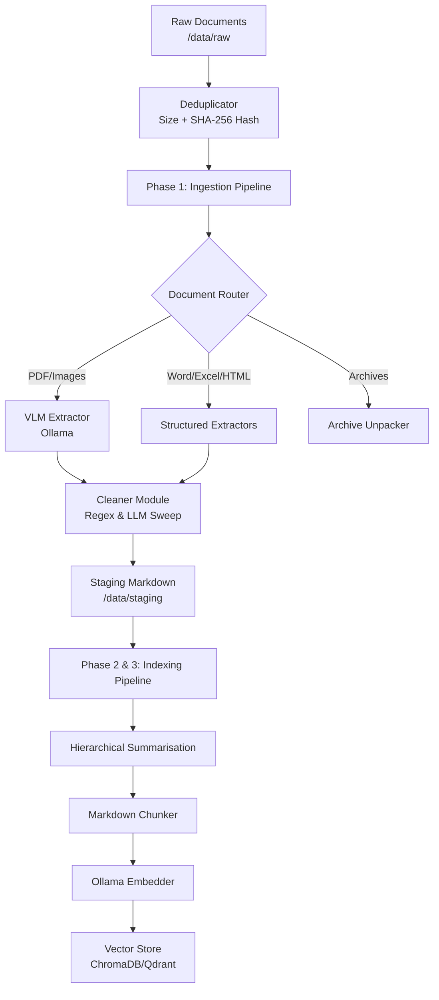

# Primer

An enterprise-grade, configuration-driven document processing pipeline designed to prepare heterogeneous files for Retrieval-Augmented Generation (RAG). 

Built heavily upon **SOLID** principles, this framework avoids hardcoding and relies entirely on dynamic registries and a central configuration system to orchestrate file extraction, cleaning, chunking, and embedding.

```
This project was a quick experiment into RAG but i came into a lot of cleaning issues with old PDFs.  
I intended to fully complete it but decided to pivot once i learnt that rag is great for retrieving naive tokens, but terrible at nuanced context.

Specifically i was building this to guide me through a problem i had with creative writing and wanted the model to have the context of everything written. But slowly realised that for better results i need to properly change the way the information is stored.   

So instead of rag pulling things that may not have the specific meaning, i would need to create a hierarchical retrieval system and index the critical information of the documents so that the models can load the relevent information.  
```

---

## Architecture Overview

The system is cleanly divided into three major phases:

### Phase 1: Pre-processing, Extraction & Cleaning
Filters exact duplicates using a two-stage Size + SHA-256 hash deduplicator. It then converts highly diverse file formats (PDFs, Word docs, Spreadsheets, HTML, presentations, and images) into standardized, clean Markdown. It utilizes Vision Language Models (VLMs) via Ollama for complex PDFs and images, alongside robust python libraries (`pandas`, `python-docx`, `beautifulsoup4`) for text-heavy documents.

### Phase 2: Hierarchical Summarisation (Agentic RAG)
Generates high-level document and section summaries using an LLM (Ollama or Gemini) prior to chunking, ensuring semantic context is preserved for the index.

### Phase 3: Indexing
Reads the cleaned Markdown, chunks it semantically based on Markdown headers, generates embeddings, and upserts the raw chunks and hierarchical summaries into a Vector Database.



---

## Project Structure

```text
├── main.py                     # CLI Entry point
├── config/                     # Configuration directory
│   ├── config.yaml             # Default configuration profile
│   └── master_template.yaml    # Auto-generated reference of all possible config values
├── scripts/
│   └── generate_master_config.py # Script to regenerate the master template
├── TODO.md                     # Backlog, advanced RAG roadmap, and open issues
├── data/
│   ├── raw/                    # Place raw files here, organized by campaign/type
│   ├── staging/                # Cleaned, standardized markdown ready for indexing
│   └── dbs/                    # Vector databases (ChromaDB, Qdrant) and local SQL DBs
└── src/
    ├── core/
    │   └── interfaces.py       # Base classes (BaseExtractor, BaseChunker, Document, Chunk)
    ├── config/
    │   └── settings.py         # Pydantic schema enforcing config validation
    ├── extractors/
    │   └── ...                 # Dynamic routing and format-specific extractors
    ├── summarisation/
    │   └── pipeline.py         # Hierarchical summariser (Ollama/Gemini)
    ├── indexing/
    │   └── ...                 # Chunkers, Embedders, and Vector Stores
    └── utils/
        ├── cleaner.py          # Regex artifact removal
        ├── deduplicator.py     # Fast exact file duplicate filter
        └── dynamic_cleaner.py  # LLM-based hallucination cleaning
```

---

## Getting Started

### Prerequisites
1. **WSL2** (Ubuntu recommended)
2. **Python 3.12+**
3. **Ollama** installed locally (running on the host machine or within WSL). Ensure models like `minicpm-v` (for extraction) and `nomic-embed-text` (for embedding) are pulled.

### Installation
```bash
# Create a virtual environment
python -m venv .venv
source .venv/bin/activate

# Install dependencies
pip install -r requirements.txt
```

---

## Usage

The CLI (`main.py`) acts as the entry point for all phases of the pipeline. You can manage multiple configuration profiles by pointing the `--config` flag to different `.yaml` files in the `config/` folder.

### 1. Run the Extraction Pipeline (Phase 1)
To run exact deduplication and convert files in `data/raw/` into cleaned markdown files in `data/staging/`:
```bash
python main.py --config config/config.yaml --action extract
```
*Note: You can control the behavior of this phase via the `pipeline.mode` setting (e.g., `extract_and_clean`, `extract_only`, `clean_only`).*

**To run a single file:**
```bash
python main.py --config config/config.yaml --action extract --file "my_document.pdf"
```

### 2. Run the Indexing Pipeline (Phases 2 & 3)
Once your files are cleaned and sitting in `data/staging/`, summarize, chunk, and embed them into your Vector Database:
```bash
python main.py --config config/config.yaml --action index
```

---

## Configuration

This framework avoids hardcoding entirely. Everything is configurable via profiles in the `config/` directory.

### The Master Template & Hooks
The pipeline's full schema is defined by Pydantic models in `src/config/settings.py`. Whenever the code changes, a Git Pre-Commit hook automatically runs `scripts/generate_master_config.py` to rebuild the `config/master_template.yaml` file. 

You should reference `config/master_template.yaml` to see all possible options you can pass into your active `config.yaml` profile.

### Extractor Routing
You can define exact behavior based on file extensions. For example:
```yaml
file_rules:
  .docx:
    extractor: "DocxExtractor"
    fallback: "UniversalExtractor"
    params:
      strip_comments: true
```

### Cleaner Module
VLM models frequently hallucinate metadata. You can apply dynamic regex sweeps to strip these out across all extracted documents, or toggle a dynamic LLM cleaner.
```yaml
cleanup_rules:
  regex_removals:
    - '(?im)^.*The image shows.*$'
```

### Indexing Setup
You can easily hot-swap your Vector Database or Embedding model by changing the string pointers:
```yaml
indexing:
  chunker:
    type: "MarkdownChunker"
  embedder:
    type: "OllamaEmbedder"
    params:
      model: "nomic-embed-text"
  vectorstore:
    type: "ChromaDBStore" # Easily swap to QdrantStore
    params:
      persist_directory: "data/dbs/chromadb"
```

---

## Extending the Framework & Roadmap

To adhere to SOLID principles, you should **never** modify the `IngestionPipeline` or `IndexingPipeline` directly to add new formats. 

Instead:
1. Create a new class inheriting from the appropriate interface in `src/core/interfaces.py`.
2. Register it in the respective `registry.py` (e.g., `EXTRACTOR_REGISTRY`).
3. Point to it in your active `config.yaml`.

### Future Roadmap
Check out the [`TODO.md`](./TODO.md) file for upcoming features and advanced RAG concepts we plan to build, including:
- **Intelligent Curation:** Semantic fuzzy deduplication and document version clustering (Supersession vs. Temporal Indexing).
- **Multi-Language Support:** Handling non-Latin character sets and integrating multilingual embedding models.
- **Diagram Handling:** VLM extraction of flowcharts into Mermaid.js.
