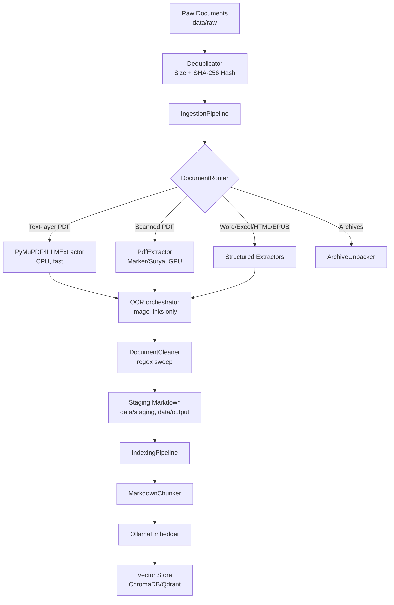

# RAG Document Ingester

> **Project Status: Undergoing Pivot & Rework**
>
> The downstream indexing, vector storage, and querying components of this pipeline are temporarily parked. The current focus is heavily on **extraction fidelity, validation, and source auditing**, specifically for complex textbook formats.

---

## The Development Journey
This project began as an end-to-end RAG pipeline designed to ingest RPG sourcebooks. After building the foundational extraction (PyMuPDF, Marker/Surya OCR) and indexing (ChromaDB, Ollama) loops, several challenges emerged:
* As the range of documents expanded, development struggled to keep pace with requirements.
* The pipeline lacked validation and auditing for the data it ingested.
* We discovered that downstream RAG quality is entirely bottlenecked by upstream extraction fidelity—especially for complex layouts, mathematical equations, and poorly scanned PDFs.

Because of these learnings, the project has pivoted. Before we can reliably index and query, we must ensure we are extracting the best possible text. The current workflow is focused on **Source Auditing (Path T1)** and **Textbook Extraction (Path T2)**.

---

## Current Focus: Source Auditing & Verification
Instead of blindly feeding documents into a pipeline, the intake process now requires measuring and choosing the best candidate file (e.g., EPUB vs. PDF) for a given book.

### The Intake Workflow
1. **Candidate Evaluation:** We gather multiple candidate files per book and evaluate them using `audit_sources.py`.
2. **Metrics Measured:** The audit inspects metadata, text density, structure (real headings vs. flat text), and math support (MathML vs. LaTeX alt-text vs. raw images).
3. **The Manifest:** Decisions and recommendations are recorded in `data/raw/textbooks/manifest.yaml`.
4. **High-Fidelity Extraction:** The chosen file is extracted with a focus on preserving hierarchical structure, math, and tables, which will eventually yield much higher-quality chunks.

---

## Getting Started

### Prerequisites
1. **WSL2** (Ubuntu) or native Linux.
2. **Python 3.12+**.
3. **Ollama**, reachable from wherever the pipeline runs (used for downstream RAG and embedding).

### Installation
```bash
python -m venv .venv
source .venv/bin/activate
pip install -r requirements.txt
```

> [!IMPORTANT]
> **Dependency pinning.** `marker-pdf==0.3.10` and `surya-ocr==0.6.13` are pinned deliberately for local GPU compatibility. See `CLAUDE.md` for this project's actual measured hardware limits before running anything GPU-heavy.

---

## Usage

### 1. Active Focus: Auditing and Extraction
```bash
# Run an audit on a specific book's candidates to update the manifest
python audit_sources.py --write --book "Machine Learning for Text"

# Single file extraction (skips deduplication) - recommended for testing new extraction rules
python main.py config/<profile>.yaml --file "data/raw/textbooks/<book>.<ext>"
```

### 2. Downstream RAG (Currently Parked)
The downstream pipeline still functions but is not the active development focus.
```bash
# Full run: dedup -> extract -> OCR -> clean -> (chunk -> embed -> upsert if indexing.enabled)
python main.py config/<profile>.yaml

# Query the vector store via CLI
python query.py config/<profile>.yaml "what is the weakness of the Ahrimanes bloodline?"

# Launch the MVP Chat Interface (Streamlit)
streamlit run app.py -- config/<profile>.yaml
```

---

## High-Level Architecture

The system is split into two sequential pipelines, chained through the filesystem:

1. **`IngestionPipeline` (`src/pipeline.py`) - *Active Focus***
   Filters duplicates, converts diverse file formats (PDFs, Word docs, EPUBs, HTML) into standardized Markdown, applies OCR if necessary, and cleans the text. Writes staged Markdown + YAML frontmatter to `io.directories.staging`, then to `io.directories.output`.
2. **`IndexingPipeline` (`src/index/pipeline.py`) - *Parked***
   Reads Markdown, chunks it by headers, embeds each chunk, and upserts into a vector store (ChromaDB/Qdrant).

<details>
<summary>View Architecture Diagram</summary>


</details>

### Condensed Project Structure
```text
├── main.py                     # CLI entry point
├── audit_sources.py            # CLI for auditing source files (Current focus)
├── TODO.md                     # Backlog and open issues (Paths T1, T2, T3)
├── CLAUDE.md                   # Architecture notes + hardware limits
├── data/                       # raw/, staging/, output/, dbs/ (gitignored)
├── src/
│   ├── audit/                  # Source file auditing and metrics
│   ├── extract/                # Format-specific extractors & DocumentRouter
│   ├── clean/                  # DocumentCleaner (regex sweeps)
│   ├── vision/                 # OCR orchestrator (Marker/Gemini)
│   └── index/                  # MarkdownChunker, Embedders, VectorStores
└── tests/                      # pytest suite
```

---

## Roadmap & Configuration

*   **Roadmap:** Please see [`TODO.md`](./TODO.md) for the active development backlog. Path T1 (Source Audit) and Path T2 (Textbook Extraction) are the immediate priorities.
*   **Configuration:** The pipeline is driven by string-keyed registries and YAML profiles validated against Pydantic schemas in `src/config/settings.py` (`extra="forbid"` ensures misspelled keys raise errors).
*   **Extending:** To add a new extractor, chunker, or embedder, implement the relevant interface in `src/core/interfaces.py`, register it in the matching `registry.py`, and reference it in a config profile.
